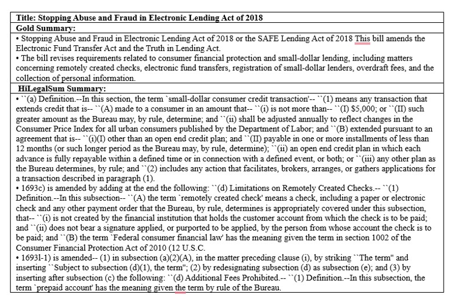

# HiLegalSum – Legal Text Summarization

HiLegalSum is a hybrid extractive text summarization system designed for long and complex legal documents.  
The project focuses on improving summary quality by combining semantic similarity, positional importance,
TF-IDF relevance, legal keyword awareness, and graph-based sentence centrality.

This work is part of a **group academic research project** and emphasizes methodology design, evaluation,
and documentation for legal-domain NLP systems.

---

## Project Type
Group Academic Research Project

---

## My Role
**Research & Documentation**

My contributions to this project were research-oriented and included:
- Conducting literature review on legal text summarization techniques
- Designing the overall methodology and evaluation strategy
- Analyzing experimental results and model behavior
- Writing and revising the research paper and project documentation

> Note: The Python-based implementation was developed collaboratively as part of the group project.

---

## Methodology Overview
HiLegalSum follows a hybrid extractive summarization pipeline involving:
- Sentence segmentation and preprocessing
- Sentence embeddings using Sentence-BERT
- Graph-based semantic similarity and centrality scoring
- TF-IDF-based relevance weighting
- Legal keyword awareness
- Redundancy reduction using Maximal Marginal Relevance (MMR)

This design prioritizes **interpretability**, **domain relevance**, and **factual consistency**, which are
critical in legal summarization tasks.

---

## Dataset
The model is evaluated using the **BillSum dataset**, which contains long legislative documents paired
with professionally written reference summaries. The dataset reflects real-world legal language,
structure, and complexity.

---

## Results Summary
- Outperformed classical extractive baselines such as Lead-3, Random, LexRank, and TextRank
- Achieved higher ROUGE and BERTScore metrics across evaluations
- Effectively compressed long legal documents while preserving key legal meaning

Detailed quantitative and qualitative results are discussed in the research paper.

---

## Sample Summary Comparison
The following example shows a qualitative comparison between a human-written (gold) summary and the
summary generated by the HiLegalSum model for a legal bill from the BillSum dataset.

---

## Repository Structure
